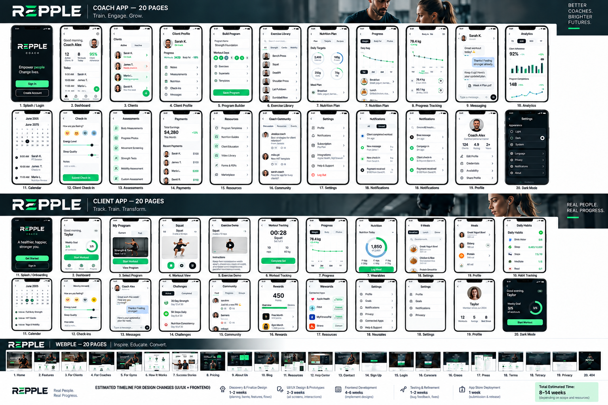

# Repple Redesign — Claude Code Execution Brief

**Prepared:** September 19, 2026  
**Required branch:** `repple-redesign`  
**App version:** `1.3.0` for Client, Coach, and Studio  
**Scope:** Repple Fitness Client app, Coach app, Studio/Owner app, and `repplefitness.com`  
**Out of scope:** PassionJet Washateria and unrelated repositories/products

## Approved visual direction

The attached review board is the visual source of truth:



File: `docs/claude-handoff/repple-approved-mockups-high-res.png`

The board contains:

- 20 Coach app screens
- 20 Client app screens
- 20 website page concepts
- Light and dark examples
- The intended compact hierarchy, white space, green accent use, navigation, cards, charts, lists, and primary actions

Treat this as a composition target, not general inspiration. The delivered screens must visibly resemble these mockups while continuing to use real application data and behavior.

## Start here

1. Confirm the active branch is `repple-redesign`. Never modify, merge into, rebase, or reset `main`.
2. Read `docs/REDESIGN-20-LANES.md` completely.
3. Inspect current committed and uncommitted work before editing. Do not discard or overwrite existing changes.
4. Compare every priority runtime screen directly with the approved mockup board.
5. Preserve working functionality. This is a redesign and simplification effort, not a backend rewrite.

Recent committed milestones on `repple-redesign`:

- `40bf9ee` — client surfaces rebuilt from approved mockups
- `a0f77db` — coach priority workflows rebuilt from approved mockups
- `168e51e` — website rebuilt around approved dark product direction

There may be additional uncommitted work in Client, Coach, Studio/Owner, shared navigation, and version files. Inspect each owned path before changing it.

## Non-negotiable engineering constraints

Preserve all of the following:

- Backend logic and Supabase contracts
- Existing routes and deep links
- Authentication, role boundaries, and permissions
- Real data contracts; never invent production data
- Truthful loading, empty, partial-read, error, and offline states
- Offline queue/outbox behavior and retry semantics
- White-label brands, app variants, domains, icons, and accents
- Light mode and dark mode
- Accessibility roles, labels, focus order, contrast, and reduced-motion behavior
- Dynamic Type/larger text and responsive layouts
- Locale, date, time, unit, and currency behavior
- Existing working actions, navigation, persistence, notifications, and wearable integrations

Do not rewrite working functionality merely to make the code look cleaner. Refactor only where it is required to deliver the approved workflow or safely decompose an oversized screen.

## Navigation that must remain intact

Client primary tabs:

1. Home
2. Train
3. Meals
4. Progress
5. Me

Coach primary tabs:

1. Clients
2. Programs
3. Schedule
4. Videos
5. Analytics
6. Profile

Secondary routes should remain reachable, but they should not compete with the primary tasks shown in the mockups.

## 20-lane roadmap

### Client app — lanes 1–8

1. **Home / Daily Briefing** — one obvious next action, weekly goal, readiness, notices, offline/outbox truth, minimal dashboard clutter.
2. **Training / Workout Execution** — program selection, exercise visual, active set logging, rest timer, completion, history/editing, records, progression, and lifting tools.
3. **Meals / Nutrition / Food Logging** — daily targets, actual intake, coach guidance, meal list, food log, restaurant/eating-out flow, and water/habits links.
4. **Progress / Body / Recovery** — weight/body trends, measurements, photos, comparisons, recovery, glucose, and wearables without false precision.
5. **Coach Relationship / Messaging / Check-ins** — coach profile, chat, weekly check-in, feedback, invitations, and trainer discovery as one coherent relationship flow.
6. **Schedule / Classes / PT / Attendance** — calendar, bookings, classes, PT sessions, standing appointments, attendance, credits, cancellation, and rescheduling.
7. **Account / Onboarding / Security / Settings** — onboarding, profile, connected apps, notification preferences, privacy, security, subscription, and support.
8. **Client QA / First-run / Risk States** — first-run guidance, incomplete setup, drift/risk prompts, navigation cleanup, accessibility, responsive behavior, and dark mode.

### Coach app — lanes 9–16

9. **Dashboard / Clients / Attention Queue** — compact KPIs, today’s schedule, clients requiring action, client search/filtering, and one clear add/invite action.
10. **Client Detail / Coaching Record** — centered client identity, progress summary, program, measurements, nutrition, check-ins, messages, photos, attendance, goals, intake, and reports through progressive disclosure.
11. **Program Builder / Templates / Exercise Library** — compact program name, workout-day controls, exercises, supersets, templates, assignment state, and persistent Save Program action.
12. **Schedule / Sessions / Classes** — month/day calendar, daily agenda, sessions, log-session flow, classes, class check-in, and register operations.
13. **Messaging / Broadcast / Nudges** — client chat, saved messages, broadcasts, broadcast sessions, nudges, notifications, audience, and delivery state.
14. **Analytics / Retention / Referrals / Leads** — client outcomes, adherence, capacity, retention, referrals, leads, attribution, and only then vanity metrics.
15. **Money / Billing / Payments / Costs** — coach revenue, platform fees, client payments, invoices, receipts, costs, and statements in one truthful financial view.
16. **Profile / Brand / Credentials / Settings** — professional identity, availability, credentials, brand, share kit, documents, integrations, settings, and getting-started assistance.

### Website and shared quality — lanes 17–20

17. **Website IA / Homepage** — explain the Client, Coach, and Gym/Studio products within ten seconds and route each audience immediately above the fold.
18. **Client / Coach / Gym Conversion Pages** — dedicated proof, benefits, product screenshots, pricing/CTA hierarchy, download/join flows, and audience-specific conversion copy.
19. **Website Auth / Support / Content / Legal** — sign-up, login, download, join, help center, contact, blog/resources, careers, press, terms, privacy, and honest error/404 flows.
20. **Shared Design System / Integration QA** — tokens, typography, spacing, controls, accessibility, responsive behavior, Dynamic Type, dark mode, white-label QA, TypeScript/test fixes, regression testing, and final integration review.

## Phased execution plan

### Phase 0 — Protect the baseline

- Confirm branch and version `1.3.0`.
- Record existing uncommitted changes by path.
- Do not reset, clean, checkout, or overwrite user work.
- Run the fastest targeted validation available before editing.
- Establish repeatable Client, Coach, Studio, and website preview commands.

**Exit gate:** branch is safe, current changes are understood, and each product can be previewed without touching `main`.

### Phase 1 — Shared visual foundation

- Align typography, spacing, radii, surfaces, list rows, buttons, inputs, charts, and tab navigation with the approved board.
- Use the existing token/theme system; extend it instead of replacing white-label behavior.
- Make the default Repple brand green while allowing stored white-label accents to remain authoritative.
- Verify light/dark contrast, Dynamic Type, keyboard behavior, and touch targets.

**Exit gate:** shared components can reproduce the mockup language without route or behavior changes.

### Phase 2 — Highest-priority app screens

Implement and visually validate in this order:

1. Client Home
2. Coach Clients / Attention Dashboard
3. Client Training and active workout
4. Coach Client Detail
5. Coach Program Builder
6. Client Progress
7. Coach Schedule

**Exit gate:** side-by-side screenshots show the same hierarchy and flow as the approved mockups, with real data states intact.

### Phase 3 — Complete Client app

- Meals/nutrition
- Coach relationship and messaging
- Check-ins
- Calendar/bookings/classes/PT
- Challenges/community/rewards/wearables
- Profile/account/onboarding/settings
- First-run, empty, error, offline, and dark-mode passes

**Exit gate:** all five primary tabs and their important secondary flows are visually coherent and regression-tested.

### Phase 4 — Complete Coach and Studio apps

- Coach messaging, analytics, money, profile, resources, community, assessments, notifications, and dark mode
- Studio/Owner dashboard, trainers, operations, growth, brand, and shared navigation
- Preserve role boundaries and existing app variants

**Exit gate:** Coach and Studio workflows use the same visual system without losing operational functionality.

### Phase 5 — Website

- Homepage
- Member, Coach, and Gym/Studio conversion pages
- Features, how it works, success stories, pricing, about, blog/resources, help/contact
- Sign-up, login, careers, press, terms, privacy, and 404
- Responsive, accessibility, contrast, SEO, and route checks

**Exit gate:** the three-product story is immediately clear and every CTA reaches the correct existing destination.

### Phase 6 — Validation and visual approval

- Run TypeScript and all available checks continuously, not only at the end.
- Verify Client, Coach, and Studio separately.
- Capture matching light-mode and representative dark-mode screenshots.
- Produce direct mockup-versus-runtime comparisons for the priority screens.
- Fix visible mismatches before requesting approval.

**Exit gate:** the user explicitly approves the screenshots.

### Phase 7 — Release preparation

Only after explicit visual approval:

- Reconfirm version `1.3.0` and unique build numbers.
- Run final release checks.
- Build the three signed iOS variants.
- Submit each successful build to its existing TestFlight application.
- Report build IDs, submission IDs, processing state, and any required user action.

Do not build, upload, submit, or resume TestFlight before visual approval.

## Validation commands

Use the repository’s existing scripts and run them throughout implementation:

```bash
npm run typecheck
npm run check:tabs
npm run check:reads
npm run check:prose
```

Run relevant targeted tests for each changed workflow. Do not mask failures, weaken assertions, delete tests, or replace truthful data states with fixtures solely to make a screenshot pass.

## Runtime validation notes

- Xcode 27 uses **Device Hub** for the current local simulator workflow.
- Known validation device: iPhone 17 Pro, iOS 26.5.
- `simctl` has previously been unreliable because of CoreSimulator service/version mismatch. Do not assume reinstalling Simulator is the answer.
- Previous local Metro assignments were Client `8090`, Coach `8091`, and Studio `8092`; verify active processes before relying on them.
- Temporary preview mirrors under `/private/tmp` are not authoritative source code and may disappear. The workspace branch is authoritative.
- Local website previews have previously used ports `4317` and `4318`; verify the currently running preview before sharing a link.

## Git safety notes

This worktree has experienced extremely slow repository-wide `git status` and stale `index.lock` files due to long-running Git/file-provider processes.

- Prefer path-scoped `git diff`, `git diff --check`, add, and commit operations.
- Before removing an `index.lock`, verify with `lsof` and process inspection that no live Git process owns it.
- Never remove a live lock or interrupt an active commit without first confirming it is genuinely stalled.
- Commit meaningful batches by owned paths so unrelated staged Studio/Owner work is not included accidentally.
- Never use destructive reset/checkout/clean commands.

## Visual acceptance checklist

For every redesigned screen:

- It visibly follows the approved mockup composition and hierarchy.
- The existing route remains reachable.
- The primary action is unmistakable.
- Secondary actions do not compete with it.
- No production data is fabricated.
- Loading, partial, empty, error, offline, and queued-write states remain truthful.
- Light and dark modes remain coherent.
- White-label accents and identity remain functional.
- Dynamic Type/larger text remains usable.
- Accessibility semantics and contrast pass.
- No new modal exists merely to announce success.
- Relevant typechecks and tests pass.

## Release history caution

A premature Client EAS build/submission was previously cancelled:

- Build: `97765325-2551-4013-b97b-9c2c43e081b9`
- Submission: `af3c4db7-b417-431f-a5f9-b29f470a7f4d`

Do not reuse these as evidence of approval or completion.

## Copy/paste instruction for Claude Code

```text
Continue the Repple redesign from branch repple-redesign. Read docs/claude-handoff/CLAUDE-CODE-REDESIGN-BRIEF.md and docs/REDESIGN-20-LANES.md first, then inspect docs/claude-handoff/repple-approved-mockups-high-res.png. Treat the mockups as the visual composition target, not loose inspiration. Preserve all backend logic, real data contracts, routes, permissions, role boundaries, offline/outbox behavior, white-labeling, accessibility, Dynamic Type, dark mode, locale/unit/currency behavior, and working functionality. Do not modify main. Keep all three apps at version 1.3.0. Inspect and preserve existing uncommitted changes before editing. Prioritize shared design-system changes, Client Home, Coach Clients/Attention Dashboard, Client Training, Coach Client Detail, Program Builder, Client Progress, Coach Schedule, then the website. Work in parallel where file ownership does not overlap. Run typechecks and targeted tests continuously. Commit meaningful path-scoped batches. Produce faithful side-by-side runtime screenshots for approval. Do not build, upload, submit, or resume TestFlight until the user explicitly approves the screenshots.
```

